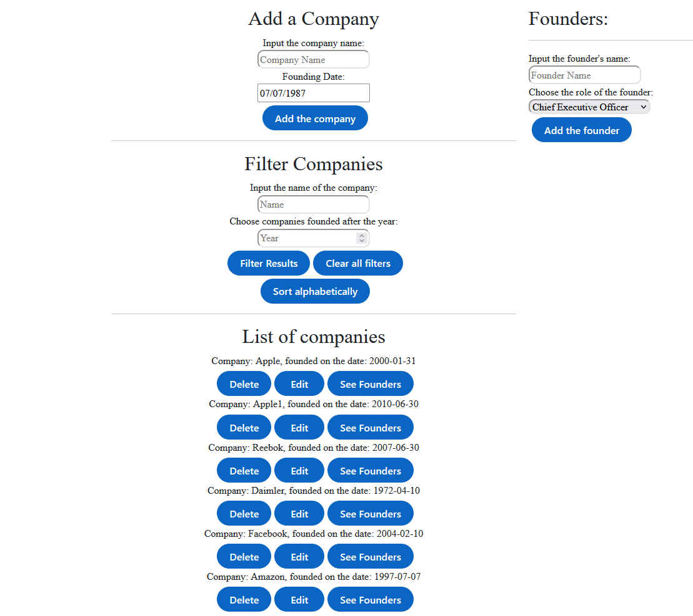

# 🏢 React-Application — Company & Founders Manager

A full-stack CRUD app for tracking companies and their founders — add, edit, delete, filter, and sort companies, then drill into each one to manage its founders.


---

## ✨ Features

- **Companies**
  - ➕ Add a company with a name and founding date
  - ✏️ Edit a company's name / founding date inline
  - 🗑️ Delete a company
  - 🔍 Filter companies by name, founding year, or both together
  - 🔤 Sort companies alphabetically by name
- **Founders**
  - 👤 Select a company to view its founders
  - ➕ Add a founder with a name and role (choose from CEO, CTO, CFO, CMO)
  - 🗑️ Delete a founder

## 📸 Showcase



## 📁 Project Structure

```
React-Application/
├── frontend/           # React client (localhost:3000)
│   └── src/
│       ├── CompanyList.js        # top-level page, wires everything together
│       ├── CompanyDB.js          # API client for the backend
│       ├── AddCompanyForm.js     # form to create a company
│       ├── FilterCompanyForm.js  # filter / sort / clear controls
│       ├── Company.js            # single company row, inline edit/delete
│       ├── AddFoundersForm.js    # form to add a founder to a company
│       └── FoundersDetails.js    # single founder row, delete
└── server/             # Express API (localhost:8080)
    ├── server.js        # routes for companies & founders
    ├── models/          # Sequelize models (Company, Founder)
    └── sqlite/          # SQLite database file
```

## 🚀 Getting Started

### Run the following commands to start the Backend

```bash
cd server
npm install
nodemon server.js
```

The API starts on **http://localhost:8080**.

### Run the following commands to start the Frontend

```bash
cd frontend
npm install
npm start
```

The app opens on **http://localhost:3000**.

## 🔌 API Reference

### Companies

| Method | Endpoint | Description |
|--------|----------|-------------|
| GET    | `/companies` | List all companies |
| GET    | `/companies/:cid` | Get a single company |
| GET    | `/companiesalph` | List companies sorted alphabetically by name |
| GET    | `/companiesFlt?name=&year=` | Filter companies by name substring and/or founding year (either param is optional) |
| POST   | `/companies` | Create a company |
| PUT    | `/companies/:cid` | Update a company's name / founding date |
| DELETE | `/companies/:cid` | Delete a company |

### Founders

| Method | Endpoint | Description |
|--------|----------|-------------|
| GET    | `/founders` | List all founders |
| GET    | `/founders/:fid` | Get a single founder |
| GET    | `/companies/:cid/founders` | List a company's founders |
| POST   | `/founders` | Create a founder |
| POST   | `/companies/:cid/founders` | Create a founder under a specific company |
| PUT    | `/founders/:fid` | Update a founder |
| PUT    | `/companies/:cid/founders/:fid` | Update a founder scoped to a company |
| DELETE | `/founders/:fid` | Delete a founder |
| DELETE | `/companies/:cid/founders/:fid` | Delete a founder scoped to a company |
